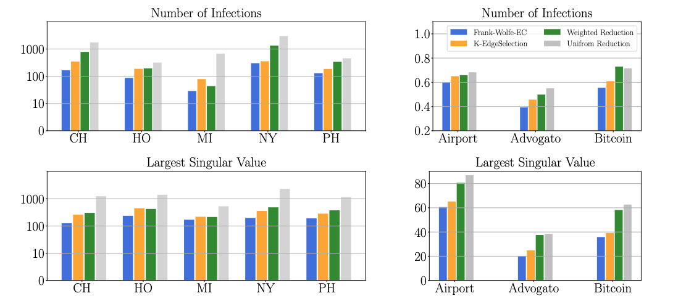

### Overview

This repository provides the implementation for the paper "Optimal Intervention on Weighted Networks via Edge Centrality", which will be presented as a poster paper in SDM 2023.

In this work, we introduce an algorithm, Frank-Wolfe-Edge Centrality, designed to reduce the number of infections during a spreading process, such as an epidemic, on both static and time-varying weighted networks. With theoretical guarantees, this algorithm minimizes the sum of the largest r singular values in the network by iterating through finding the gradient descent direction of the objective. The descent direction is given by a greedy selection of edges with the highest edge centrality values, resulting in an effective edge weight reduction method. Our algorithm exhibits significant performance on mobility networks and weighted graphs, and we offer the code to run experiments on these networks.

<div align=center></div>

### Requirements

To install requirements:

``` pip install -r requirements.txt ```

### Data Preparation

**Mobility networks** 

We follow the procedures of [Chang et al., (2021)](https://www.nature.com/articles/s41586-020-2923-3) to derive the networks from [SafeGraph COVID-19 Consortium](https://www.safegraph.com/academics). We provide the static and temporal mobility networks in the folder `./data/`. Our code handles loading the network. For the raw data to generate the networks, we refer interested readers to [the SafeGraph website](https://www.safegraph.com/blog/safegraph-partners-with-dewey) to get access to the data. 

**Weighted graphs** 

We list the link for downloading these datasets and describe how to prepare data to run our code below.

- [Airport](http://opsahl.co.uk/tnet/datasets/openflights.txt): download and place the data in `./data/social_networks/airport/`. 
- [Advogato](https://downloads.skewed.de/mirror/konect.cc/files/download.tsv.advogato.tar.bz2): download and place the data in `./data/social_networks/advogato/`. 
- [Bitcoin](http://snap.stanford.edu/data/soc-sign-bitcoinalpha.html): download and place the data in `./data/social_networks/bitcoin/`. 

If the data is placed in a different path, please change the path name in `./social/build_social_networks/`. Our code handles loading the networks.

### Usage

**Mobility networks**

Run the experiments inside the `mobility` path. Use `run_simulation_static.py` to run the experiments on static networks and `run_simulation_temporal.py` to run the experiments on time-varying networks. 

In the script, use the `--MSA` argument to specify different mobility networks. Use `--model` to specify the epidemic models from `seir`, `sir`, and `sis`. Use the `--strategy` argument to run different strategies:

- `none` for no intervention
- `uniform` for uniform scaling
- `edge_weight` for edge weighted reduction
- `capped` for max occupancy capping
- `category` for capping by POI category
- `edge_centrality_delete` for K-EdgeDeletion
- `global` for our Frank-Wolfe-EC algorithm

We provide scripts in `./mobility/scripts` to replicate the experiments on mobility networks. For example, run the experiments on the New York mobility network as follows. 

```bash
msa_name=NY
beta_base=0.0855188357042064
poi_psi=0.00293994466873546
p_zero=0.0001
budget=0.05

python run_simulation_static.py --MSA $msa_name --epochs 100 \
    --strategy global --budget $budget --top_k 1 \
    --lp_budget $budget --lp_components 42 --lp_epochs 7\
    --beta_base $beta_base \
    --poi_psi $poi_psi \
    --p_zero $p_zero
```


**Weighted graphs** 

Please run the experiments inside the `social` path. We provide scripts in `./social/scripts/` to replicate the experiments:

- run `run_intervention_AIR.sh` for the Airport network
- run `run_intervention_AD.sh` for the Advogato network
- run `run_intervention_BI.sh` for the Bitcoin network

### Citation

If you find this repository useful or happen to use it in a research paper, please cite our work with the following bib information.

```
@article{li2022optimal,
  title={Optimal Intervention on Weighted Networks via Edge Centrality},
  author={Li, Dongyue and Eliassi-Rad, Tina and Zhang, Hongyang R},
  booktitle={SIAM International Conference on Data Mining},
  year={2023}
}
```

